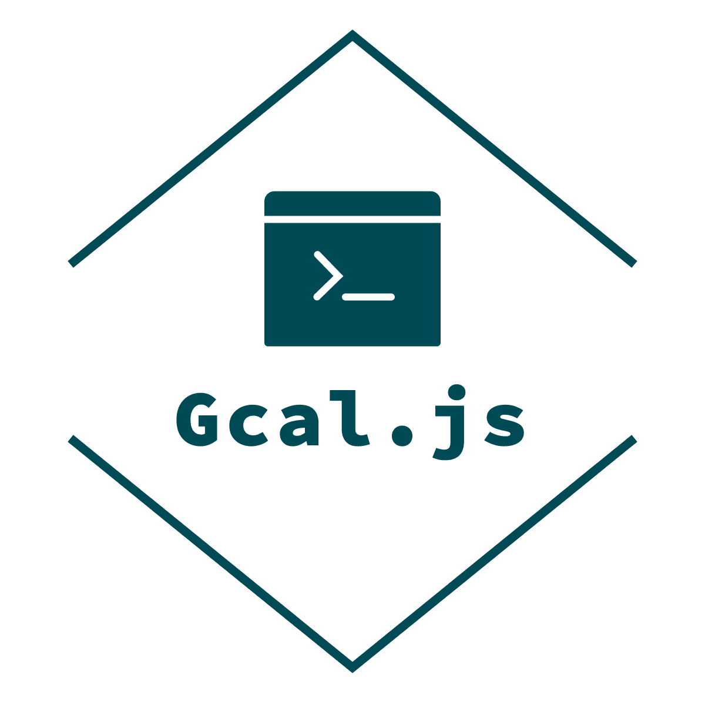
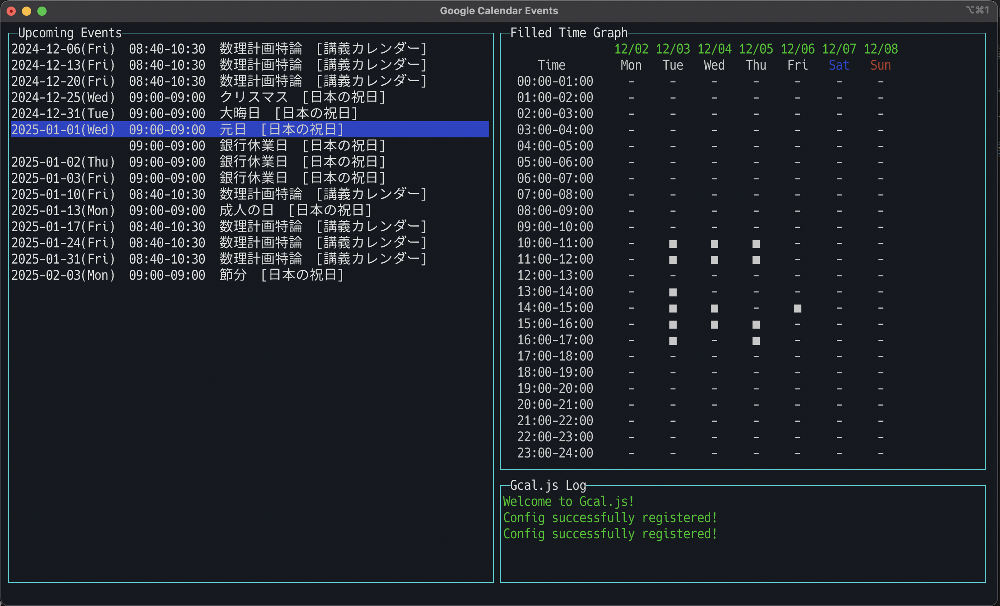

<h1 align="center">

</h1>

<p align="center">
<b>TUI</b> <b>Google Calendar<b> クライアントアプリケーション 🧑‍💻👩‍💻👨‍💻
</p>

<p align="center">


<a href="https://github.com/hosokawa-kenshin/Gcal.js/blob/main/README-ja.md">

</a>

<br>
</p>

<p>
<p align="center">
<a href="https://github.com/hosokawa-kenshin/Gcal.js" target="__blank"></a>
</p>

<p align="center">
  <a href="##Requirements">Requirements</a> •
  <a href="##Setup">Setup</a> •
  <a href="##Commands">Commands</a> •
  <a href="##License">License</a>
</p>

<p align="center">

</p>

## Requirements
- Node.js
- Google Cloud ConsoleでGoogle Calendar APIが有効になっていること
- credentials.jsonファイルがGoogle Cloud Consoleから取得され，プログラムのディレクトリに配置されていること

## Setup
### 依存パッケージのインストール

プロジェクトディレクトリで下記のコマンドを実行し，必要な依存パッケージをインストールする．
``` bash
npm install
```

### Google Calendar APIの認証情報を設定

1. Google Cloud Consoleでプロジェクトを作成し，Google Calendar APIを有効化する
2. 認証情報を作成し，OAuth 2.0クライアントIDを生成する
3. credentials.jsonファイルをダウンロードし，このプログラムと同じディレクトリに保存する

### コマンドのパスを設定

パスを通した任意のディレクトリ内に Gcal.js の実行ファイル (cldr) へのシンボリックリンクを作成する

``` bash
export PATH=path/to/your/directory:$PATH
cd your/directory
ln -s path/to/Gcal.js/cldr cldr
```
以下に設定例を示す

```bash
export PATH=$HOME/.local/bin:$PATH #(.bashrc or .zshrc に追加することで，設定を永続化)
cd ~/.local/bin
ln -s ~/git/Gcal.js/cldr cldr
```

## Usage
### 表示について
Gcal.js を起動すると，3つのテーブルが表示される．  
左には Google Calendar に登録されている予定，右上には予定が入っている日時を示すグラフ，右下にはログが表示される．  
カーソルが当たっている予定は，青色にハイライトされる．

### 基本操作
カーソルの移動には，矢印キーか `jk` キー (like vim) を用いる．  
システムの終了は `q` キーを押す
イベントの選択は，選択したいイベントにカーソルを当て `Enter` キーを押す．
コマンドラインを開くには `Space` キーを押す．

### 予定の追加・編集・削除機能および使用できるコマンド
それぞれの操作方法や，仕様，詳細については以下を参照．
- [予定の追加](https://github.com/hosokawa-kenshin/Gcal.js/blob/main/docs/cmd/add.md)

- [予定の編集](https://github.com/hosokawa-kenshin/Gcal.js/blob/main/docs/cmd/edit.md)

- [予定の削除](https://github.com/hosokawa-kenshin/Gcal.js/blob/main/docs/cmd/delete.md)

- [予定のコピー](https://github.com/hosokawa-kenshin/Gcal.js/blob/main/docs/cmd/copy.md)

- [予定参照コピー](https://github.com/hosokawa-kenshin/Gcal.js/blob/main/docs/cmd/refcopy.md)

- [表示するカレンダの選択](https://github.com/hosokawa-kenshin/Gcal.js/blob/main/docs/cmd/config.md)

- [イベント検索表示](https://github.com/hosokawa-kenshin/Gcal.js/blob/main/docs/cmd/find.md)

- [カーソル移動](https://github.com/hosokawa-kenshin/Gcal.js/blob/main/docs/cmd/jump.md)

- [Markdown出力](https://github.com/hosokawa-kenshin/Gcal.js/blob/main/docs/cmd/md.md)

- [GoogleCalendarと同期](https://github.com/hosokawa-kenshin/Gcal.js/blob/main/docs/cmd/sync.md)


## Shortcuts
一部の機能やコマンドには，ショートカットが存在する．  
また，自身の好みのキーを割り当てることも可能である．  
以下にデフォルトのキーバインドを示す．

| キー              | 説明                 |
| ----------------- | -------------------- |
| `q` or `Ctrl + c` | Gcal.js の終了       |
| `a`               | 予定の追加           |
| `n`               | カーソルを来週へ移動 |
| `p`               | カーソルを先週へ移動 |
| `Ctrl + n`        | カーソルを来月へ移動 |
| `Ctrl + p`        | カーソルを先月へ移動 |
| `t`               | カーソルを本日へ移動 |

独自キーバインドの設定は `setting.json` を書き換える．
```
{
    "keyBindings": {
        "quit": [
            "q",
            "C-c"
        ],

        [...]

        "today": [
            "t",
            "home"
        ]
    }
}
```
## License

このプロジェクトはMITライセンスの下でライセンスされている．
詳細は[LICENSE](LICENSE)ファイルを参照．